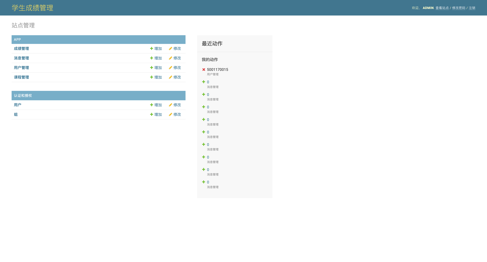

# android-stu-course-mgmt

## Dev
确保 brew 安装了以下依赖
- libpng
- openjpeg
- jpeg-xl
- freetype

之后再 `pip install -r requirements.txt`

## Screenshot

### APP 前台
 
 
 
 
 
 

### 管理后台

## Respect
Thanks for:
- https://github.com/kleinlsl/XSGManage
